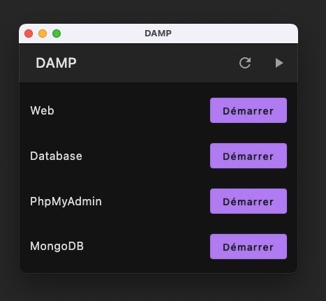
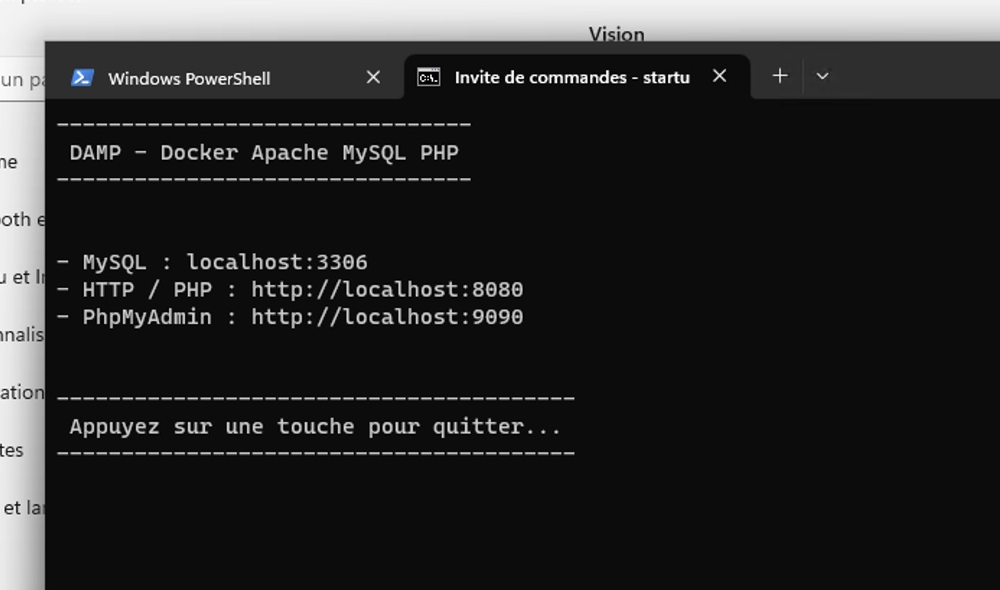

# DAMP : Docker Apache MySQL PHP

Document présentant l'installation de Docker, Apache, MySQL et PHP.

::: details Sommaire
[[toc]]
:::

## Introduction

DAMP est un acronyme pour Docker Apache MySQL PHP. Il s'agit d'un environnement de développement pour les applications web. Il repose sur Docker et permet de créer un environnement de développement en quelques minutes.

## Démo

_Interface graphique_ :



_Interface en ligne de commande_ :



### Que contient DAMP ?

DAMP contient les éléments suivants :

- PHP 8.2
- MariaDB 10.9
- PHPMyAdmin (dernière version)
- MongoDB (dernière version)

### DAMP c'est deux choses

- Un stack via Docker Compose pour créer un environnement de développement
- Une interface graphique pour gérer les conteneurs (Démarrer, arrêter, etc.)

::: tip L'interface graphique

L'interface graphique est optionnelle, vous pouvez très bien utiliser DAMP sans l'interface graphique en utilisant uniquement le script `start.sh`.

:::

## Prérequis

Pour fonctionner, vous devez avoir installé Docker et Docker Compose sur votre machine. Pour cela, il vous suffit d'installer Docker Desktop :

- [Installer Docker](https://docs.docker.com/get-docker/)

## Installation

## Windows

Pour installer DAMP, il suffit de :

- 1. [Télécharger DAMP](https://github.com/c4software/DAMP/raw/master/distribuable/win-1.0.zip)
- 2. Décompresser l'archive.
- 3. Lancer le `damp.exe`.

## Linux & MacOS

L'interface graphique n'est pas pré-compilée pour Linux et MacOS, il faut donc la compiler soit même. Pour cela, il faut :

- 1. [Clonez le dépôt](https://github.com/c4software/DAMP/tree/master).

Solution alternative :

- 1. [Clonez le dépôt Docker-Stack](https://github.com/c4software/DAMP-docker-stack).
- 2. Lancer le script `startup.sh`.

## Configuration

La configuration de DAMP se fait en modifiant les fichiers :

- `docker-compose.yml` : Contient la configuration des conteneurs
- `dockerfiles/php.dockerfile` : Contient la configuration de PHP (extensions, etc.)

La configuration de l'interface graphique se fait en modifiant le fichier `configuration.yaml` :

- `home` : Chemin vers le dossier contenant le fichier `docker-compose.yml`.
- `services` : Liste des services à afficher dans l'interface graphique.

## Utilisation

### Interface graphique

- 1. Lancer Docker Desktop.
- 2. Lancer DAMP.
- 3. Profit !

### Interface en ligne de commande

Pour utiliser DAMP en ligne de commande, il suffit d'utiliser le script `startup.sh` :

```sh
chmod +x startup.sh # Rend le script exécutable, à faire une seule fois
./startup.sh
```

Les ports utilisés par la version en ligne de commande seront affichés dans le terminal.

## Où sont les fichiers ?

Vos fichiers Web doivent être placés dans le dossier `data/htdocs`. Ce dossier est monté dans le conteneur Apache.

Ils seront ensuite accessibles via l'adresse spécifiée dans la configuration de l'interface graphique ou dans le terminal.

Vous avez de base un fichier `index.php` qui affiche le `phpinfo()`.

## FAQ

### Comment accéder à PHPMyAdmin ?

PHPMyAdmin est accessible à l'adresse suivante : [http://localhost:9090](http://localhost:9090). Cette information est également disponible dans l'interface graphique ou dans le terminal.

### Comment accéder à MongoDB ?

MongoDB est accessible à l'adresse suivante : [http://localhost:27017](http://localhost:27017). Cette information est également disponible dans l'interface graphique ou dans le terminal. 

🚨 MongoDB n'est pas démarré par défaut, il faut le démarrer dans l'interface graphique ou dans le terminal. 🚨

### Comment accéder à MariaDB ?

MariaDB est accessible via le port `3306` sur l'adresse `localhost`. Si vous souhaitez utiliser un client graphique, vous pouvez utiliser [DBeaver](https://dbeaver.io/) ou PHPMyAdmin disponible à l'adresse suivante : [http://localhost:9090](http://localhost:9090).

### Comment accéder à PHP ?

PHP est accessible à l'adresse suivante : [http://localhost:8080](http://localhost:8080). Cette information est également disponible dans l'interface graphique ou dans le terminal.

⚠️ Les sources sont à mettre dans `data/htdocs`. ⚠️

### Est-ce Open Source ?

Oui DAMP est Open Source, vous pouvez retrouver le code source sur GitHub :

- [L'interface graphique](https://github.com/c4software/DAMP)
- [La Stack Docker (et le script de démarrage)](https://github.com/c4software/DAMP-docker-stack)

### Comment puis-je contribuer ?

Vous pouvez contribuer de plusieurs manières :

- En utilisant DAMP et en remontant les bugs.
- En remontant les bugs sur GitHub.
- En proposant des améliorations sur GitHub.
- En proposant des améliorations sur le Slack de la classe.

### Comment puis-je vous contacter ?

Vous pouvez me contacter via :

- [Twitter](https://twitter.com/c4software)