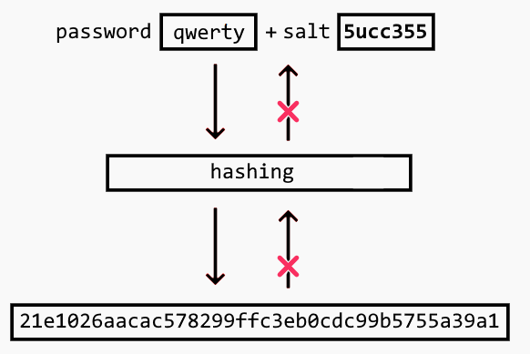
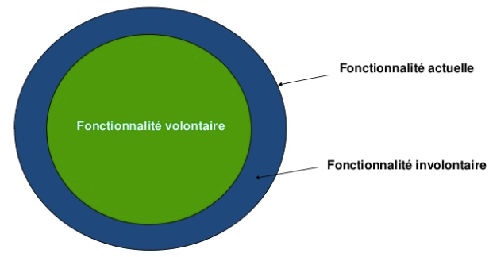

# La méthode OWASP

::: details Table des matières
[[toc]]
:::

### Comment se tenir à jour ?

Prévenir plutôt que guérir… Quelques sites à surveiller :

- [US CERT (LA SOURCE)](https://www.us-cert.gov/)
- [The Hacker News](http://thehackernews.com/)
- [Zataz](https://www.zataz.com/)
- [Reddit NetSec](https://www.reddit.com/r/netsec/)
- [Next INpact](https://www.nextinpact.com/) (~payant)
- Google Actu

::: tip Important
Vous êtes la première ligne d’informations !
:::

### Les mots de passe

Zoom sur les mots de passe :

- Un mot de passe ne doit jamais être stocké en claire.
- Un mot de passe doit être haché (non réversible).
- Un mot de passe doit être salé (ajout d’une chaîne aléatoire).

## Principes de base

Avoir un mot de passe hashé ne suffit pas. Il faut aussi le saler.



Le salage est une technique qui permet d’ajouter une chaîne aléatoire au mot de passe avant (ou après) de le hacher. Idéalement le sel est différent par utilisateur, cela permet de rendre le mot de passe unique pour chaque utilisateur.

## Le bcrypt

Le bcrypt est un algorithme de hachage qui :

- Intègre le sel.
- Intègre un coût (nombre d’itération). Plus le coût est élevé, plus le hachage est long (et donc plus sécurisé).
- Intègre un hachage (SHA-256).

## Résumé :

Les mots de passe :

- Un mot de passe ne doit jamais être stocké en claire. Il doit être haché (non réversible) et salé (ajout d’une chaîne aléatoire).
- Le sel peut-être différent pour chaque utilisateur ou global pour tous les utilisateurs. Celui-ci doit être placé avant ou après le mot de passe, il sera utilisé également pour vérifier le mot de passe.
- Le bcrypt est un algorithme de hachage qui intègre le sel, le coût et le hachage (SHA-256).

## Authentification à plusieurs facteurs

3 formes d'authentification :

- Mémorielle qui représente une chose que l'intéressé connaît (un secret),
- Matérielle qui se réfère à quelque chose qu'il possède (un objet),
- Corporelle qui utilise un trait physique de l'utilisateur (une biométrie).

Des **outils** :

- **Mot de passe :** Un mot de passe avec un niveau de sécurité suffisant (longueur, caractères spéciaux, majuscules, minuscules, chiffres).
- **Application :** OTP (One Time Password) : SMS, Google Authenticator, Authy, Yubikey.
- **Objet physique :** U2F (Universal 2nd Factor) : Clé USB, Yubikey.
- **Biométrie :** Empreinte digitale, Reconnaissance faciale.

Mais surtout c'est :

- Permets de sécuriser les mots de passe en ajoutant une couche de sécurité supplémentaire.
- Via un secret partagé entre la personne **physique** et le site.

### Les impacts liés à la sécurité

La sécurité informatique dans une application c’est un « équilibre »

- Impact fonctionnel
- Limitation de l’expérience utilisateur (UX)
- Impact financier


### Les types de failles

- L’humain (Social Engineering)
- D'accès (physique)
- Applicatif (Hack)
- L’argent (jusqu’à quel montant une personne donne l’information ?)

### Le Social Engineering

Les gens sont souvent trop confiants. Il faut donc les former régulièrement à la sécurité.

Deux exemples en vidéo :

|                                            |                                                         |
| :----------------------------------------------------------------------: | :-----------------------------------------------------------------------------------------: |
| [Exemple SECTF à la DefCon](https://www.youtube.com/watch?v=-FSLaHKoCNE) | [Call Recreation (@5min, @11min30)](https://share.vidyard.com/watch/i46XF6N6rpR9KMaorihFQw) |

## Intégrer la sécurité à toutes les étapes

La sécurité c’est un état d’esprit à intégrer.

C’est **votre métier**


### Assurer la qualité

S'assurer d'une qualité continue du code avec :

- Des règles à connaitre (OWASP).
- Des tests unitaires.
- Une analyse automatique du code (SonarQube).

### Open Web Application Security Project (OWASP)

> Open Web Application Security Project (OWASP) est une communauté en ligne travaillant sur la sécurité des applications Web. Sa philosophie est d'être à la fois libre et ouverte à tous. Elle a pour vocation de publier des recommandations de sécurisation Web et de proposer aux internautes, administrateurs et entreprises des méthodes et outils de référence permettant de contrôler le niveau de sécurisation de ses applications Web.

> _Source: Wikipedia_

[Site de Owasp](https://owasp.org/)

OWASP liste 10 grandes catégories de failles **à connaitre** :

### A1 - Injection

Injection SQL, Shell...

Souvent la plus connue et la plus rencontrée :

```sql
SELECT * FROM client WHERE id='" . $_GET["id"] . "'
```

```
http://exemple.com/liste?id='or '1'='1
```

::: tip C'est la base de la sécurité

Vous trouverez cette exemple un peu partout. C'est le mauvais exemple en termes de sécurité !

Au passage, si vous écrivez :

```php
$id = $_GET['id'];
$maRequete = "SELECT * FROM client WHERE id='{$id}'"
```

⚠️ C'est aussi une faille, celle-ci est identique à la précédente.

:::

#### Comment corriger ?

- Toujours utiliser des requêtes préparées.
- Ou utiliser des ORM (Object Relational Mapping) qui font la même chose.

```php
$maRequete = $pdo->prepare("SELECT * FROM client WHERE id=:id");
$maRequete->execute(['id' => $_GET['id']]);
```

### A2 - Violation de Gestion d’Authentification et de Session

Risque de casser / usurper une authentification ou une session. Comprends notamment le vol de session ou la récupération de mots de passe.

Une session en paramètre GET == ⚠️. Si vous partagez le lien, n'importe qui pourra obtenir votre accès !

```
http://exemple.com/?jsessionid=A2938298D293
```

#### Comment corriger ?

- Toujours utiliser des sessions cryptées.
- Toujours utiliser des sessions avec un identifiant unique.
- Toujours utiliser des sessions avec un TTL (Time To Live).

### A3 - Cross-Site Scripting (XSS)

Risque d'injection de contenu dans une page pour but de provoquer des actions non désirées dans celle-ci.

Les failles XSS sont particulièrement répandues parmi les failles de sécurités Web.

Exécution de code JavaScript sans validation. Le risque ici est qu'il est possible de changer le comportement initialement attendu pour en détourner le sens.

```html
Votre Nom : <input type="text" name="nom" value="" />
```

```js
alert("Bonjour " + $_POST["nom"]);
```

Deux types sont à connaitre :

- XSS Persistant (Stocké)
- XSS Reflété (via un lien)

#### Comment corriger ?

- Toujours valider les entrées utilisateurs.

```php
$nom = filter_input(INPUT_POST, 'nom', FILTER_SANITIZE_STRING);
```

### A4 - Références directes non sécurisées à un objet

Accès à de la donnée en spécifiant un `id` directement par un paramètre non filtré.

C'est également quelque chose de très courant. Si vous attendez en paramètre un mode / un id, veillez à toujours contrôler si la ressource chargée correspond aux droits de l'utilisateur.

Si je change client par … admin ?

```
http://exemple.com/liste?mode=client
```

```sql
SELECT * FROM client where mode=?
```

```php
$stmt->bindParam(1, $mode);
```

::: tip Requête préparée

Vous noterez ici que nous avons une requête « préparé » ça n'empêche pas le danger…

:::

#### Comment corriger ?

- Toujours valider les entrées utilisateurs.
- Toujours vérifier les droits de l'utilisateur.

```php
if ($_SESSION['mode'] == 'client') {
    // On peut charger la ressource
} else if ($_SESSION['mode'] == 'admin') {
    // On peut charger la ressource
} else {
    // On ne peut pas charger la ressource
}
```

### A5 - Mauvaise configuration Sécurité

Corresponds aux failles de configuration liées aux serveurs Web, applications, base de données ou frameworks.

- Console d’administration disponible sans authentification en ligne.
- Listage des répertoires ([Exemple](https://www.google.fr/search?dcr=0&q=intitle%3A%22Index%20of%22))
- Exemples de code non supprimés.
- Application en debug.

#### Comment corriger ?

- Toujours supprimer les exemples de code.
- Toujours supprimer les répertoires de débug.
- Lire la documentation.

### A6 - Exposition de données sensibles

Exposition de données sensibles comme les mots de passe, les numéros de carte de paiement ou encore les données personnelles et la nécessité de chiffrer ces données.

- Espace client sans SSL.
- Mot de passe en claire (ou en MD5) dans la base de données.
- Sauvegarde de données inutiles.

#### Comment corriger ?

- Toujours utiliser le HTTPS.
- Toujours utiliser des mots de passe chiffrés (hashés + sel).
- Toujours supprimer les données inutiles.

### A7 - Manque de contrôle d’accès au niveau fonctionnel

Failles liées aux contrôles d'accès de fonctionnalité.

- Page d’admin accessible avec un compte utilisateur.
- Mode non filtré (similaire à l’exemple mode={client,admin}).

#### Comment corriger ?

- Toujours vérifier les droits de l'utilisateur.

```php
if ($_SESSION['mode'] == 'client') {
    // On peut charger la ressource
} else if ($_SESSION['mode'] == 'admin') {
    // On peut charger la ressource
} else {
    // On ne peut pas charger la ressource
}
```

### A8 - Falsification de requête intersite (CSRF)

Failles liées à l’exécution de requêtes à l’insu de l’utilisateur.

- Rejeu de requête déjà joué.

::: tip Comment le bloquer ?

Ajouter un identifiant/jeton dans la requête, unique et non réutilisable. Intégré de base dans Laravel.

:::

#### Comment corriger ?

- Ajouter un jeton unique dans les formulaires.

```php
<input type="hidden" name="_token" value="{{ csrf_token() }}">

// Côté PHP
if (isset($_POST['_token']) && $_POST['_token'] == $_SESSION['_token']) {
    // On peut traiter la requête
} else {
    die();
}
```

### A9 - Utilisation de composants avec des vulnérabilités connues

Failles liées à l’utilisation de composants tiers vulnérables.

- CMS non à jour
- Apache / Tomcat non patchés
- Librairies XYZ non à jour

#### Comment corriger ?

- Toujours mettre à jour les composants tiers.
- Ne pas utiliser des vieux frameworks (exemple PHP 4, ou Symfony 1.4)

### A10 - Redirections et Renvois Non Validés

Les redirections et les renvois non validés sont une vulnérabilité profitant d’une faiblesse dans le code et dont l’objectif est de rediriger l’utilisateur sur une page malveillante

- Utilisation de votre site comme « masque » dans du phishing

_Exemple :_

```
http://www.shop-vdt.com/login.php?goto=evil.com/login
```

#### Comment corriger ?

- Toujours valider les entrées utilisateurs.
- Filtrer les liens possibles.

```php
// Autorise uniquement les redirections vers le site
if (preg_match('/^https?:\/\/shop-vdt\.com\//', $_GET['goto'])) {
    header('Location: ' . $_GET['goto']);
} else {
    die();
}
```

### Mais, une faille c’est quoi ?



L'idée d'OWASP, c'est de former pour comprendre les failles afin de ne plus les produire involontairement… Et surtout avec OWASP on parle de **vulnérabilité, et non de risque**.

## Les outils OWASP

- [OWASP Juice Shop (Formation, JavaScript)](https://owasp.org/www-project-juice-shop/)
- WebGoat (Formation, Java)
- WebScarab (Audit)
- OWASP Testing guide (Guide pour voir le niveau de sécu)
- OWASP Code Review guide (Méthode d’audit)

## Synthèse OWASP

