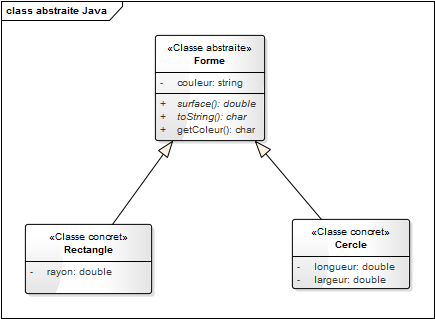

# Le Polymorphisme : Mise en pratique

::: details Table des matières
[[toc]]
:::

## Introduction

Dans cette mise en pratique, nous allons voir comment l'intérêt du Polymorphisme. Le polymorphisme est le fait qu'une classe mère peut prendre plusieurs formes (**poly** : plusieurs, **morphisme** : forme). Avec le polymorphisme nous pouvons donc écrire sans que cela pose problème :

```java
Forme monDessin = new Cercle() ;
Forme monDessin = new Rectangle() ;
```

::: tip Un instant !

C'est possible évidemment seulement si `Cercle` et `Rectangle` héritent de `Forme` :



:::

## Exercice 1

Écrire les classes nécessaires au fonctionnement du programme suivant, pour cet exercice vous ne fournirez seulement les les méthodes nécessaires au fonctionnement.

::: tip Évidemment…
Vous n'oublierez pas de commenter votre code !
:::

Le PHP ne permettant pas d'illustrer entièrement le polymorphisme nous allons travailler avec un exemple en Java

```java
public class TestMetiers {
    public static void main(String[] argv) {
        ArrayList<Coronavirus> coronavirusList = new ArrayList<Coronavirus>();

        coronavirusList.add(new Alpha("B.1.1.7"))
        coronavirusList.add(new Beta("B.1.351"))
        coronavirusList.add(new Gamma("P.1"))
        coronavirusList.add(new Omicron("B.1.1.529"))
        coronavirusList.add(new Gamma("P.1"))
        coronavirusList.add(new Delta("B.1.617.2"))
        coronavirusList.add(new Omicron("B.1.1.529"))
        coronavirusList.add(new Alpha("B.1.1.7"))
        coronavirusList.add(new Omicron("B.1.1.529"))

        coronavirusList.forEach(element -> {
            element.affiche();
        })
    }

}
```

::: tip Avant d'attaquer

- Réfléchissez à la modélisation UML.
  - Combien devons-nous créer de classe ?
- Comment est-ce possible de sauvegarder dans une même liste des objets de type différent ?
- Question code, comment s'appelle l'écriture à l'intérieur du `ForEach` ?

:::
