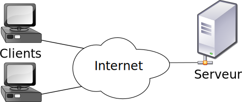
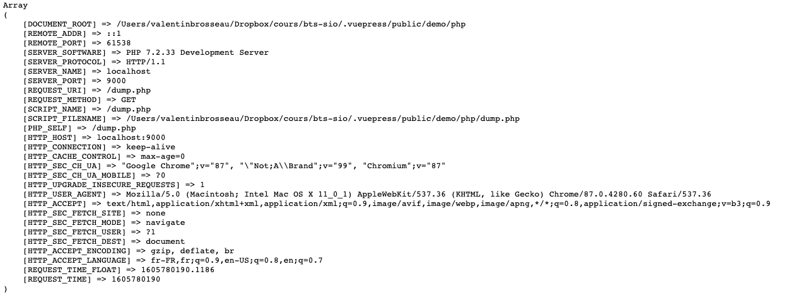
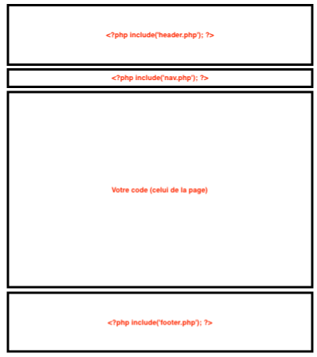
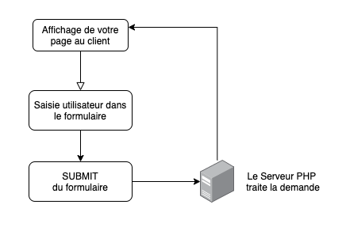
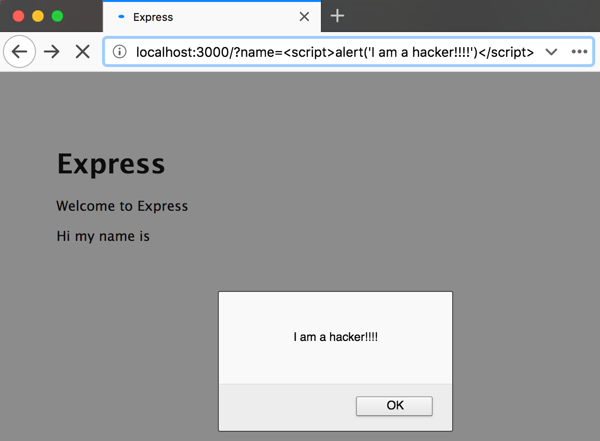
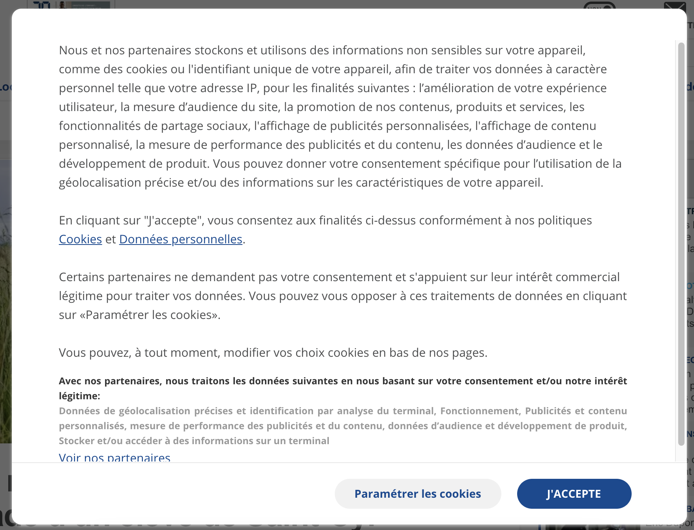
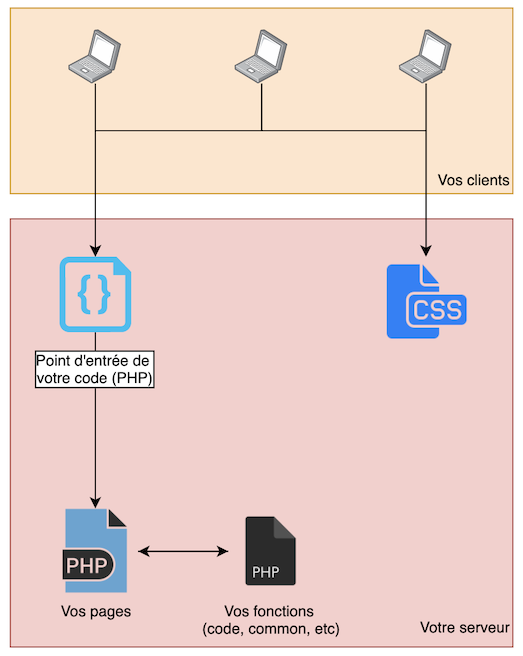

# Complément du cours PHP

Ce document est un complément du cours. Il vous permettra de revenir sur les différentes notions avec différents exemples.

::: details Table des matières
[[toc]]
:::

## Boite à outils

Le PHP est présent depuis de nombreuses années sur Internet, il faut donc être très vigilant aux codes que nous trouvons ! En effet le PHP a énormément évolué et ne fonctionne plus vraiment comme avant. Dans un cas comme celui-ci, je vous conseille la documentation officielle en priorité :

- [Manuel PHP.net](https://www.php.net/manual/fr/)
- [MDN](https://developer.mozilla.org/en-US/docs/Glossary/PHP)
- [Intro PHP W3School](https://www.w3schools.com/PhP/php_intro.asp)

## Introduction

Le PHP est un langage de script largement utilisé sur Internet (Wordpress, Facebook …). Il existe depuis 1994, à l'origine le nom signifiait « **P**ersonal **H**ome **P**age » mais on lui préfère maintenant une signification bien plus large « **P**HP : **H**ypertext **P**reprocessor ».

::: warning Un instant

Si vous ne l'avez pas déjà fait. Je vous conseille vivement d'aller regarder les cours [Base HTML](/cheatsheets/html/) et le cours [Base CSS](/tp/html_css/support.html). Ils nous serviront de bases aux éléments abordés dans notre introduction au PHP.

:::

Le PHP est un langage serveur permettant notamment la génération de code HTML. Nous entrerons plus en détail ultérieurement sur ces différentes notions.

## Le fonctionnement

Le PHP est un langage de programmation « Procédurale **et/ou** objet », beaucoup d'entreprises l'utilisent (même si en France il a parfois mauvaise réputation). Facebook est en grande partie en PHP, Worpress est écrit en PHP. C'est massivement utilisé, il est donc **incontournable** pour vous développeur Web.

Il repose sur le principe de client / serveur. C'est une notion fondamentale à comprendre, votre navigateur n'est pas seul dans le monde de l'Internet, nous avons des serveurs, **beaucoup de serveurs**. Nous avons donc deux acteurs :

**Les clients** ce sont les ordinateurs, smartphones, voitures bref tout ce qui peut faire une requête Web. Ils seront les visiteurs de votre site Internet.
**Les serveurs** ils délivrent les données à vos visiteurs, ils sont parfois très puissants pour assurer une forte charge… ou alors très léger! Comme par exemple, un Raspberry Pi derrière une Freebox. Ils n'ont pas forcément d'écran, ils ont des services qui délivrent du contenu « compréhensible par un client (Web, Api, …) ».

|  |
| :-----------------------------------------: |
|      _Nos clients et le(s) seveur(s)_       |

::: danger Internet ≠ Chrome
Actuellement vous consommez Internet comme un utilisateur Web, mais Internet c'est pas seulement ça. C'est également des services [appelés API](https://fr.wikipedia.org/wiki/Interface_de_programmation) qui permettent la communication entre deux systèmes informatiques (exemple Instagram sur votre Téléphone communique par API avec les serveurs de Facebook) dans un langage appelé JSON.
:::

### Statique ou Dynamique ?

Il y'a deux écoles !

**Le statique**, c'est ce que nous avons vu ensemble au début. C'est simplement du code HTML écrit « en dur » qui ne change donc jamais côté serveur à chaque chargement. Pour le mettre à jour, il faut mettre à jour les fichiers HTML à la main sur le serveur. **Avantage**, ils sont très rapides et permettre de répondre très rapidement aux demandes des clients. Parfait donc pour un site vitrine.

**Le Dynamique**, c'est ce que nous allons voir avec PHP, il s'agit de faire travailler le serveur pour générer une page « différente » pour chaque utilisateur. La mise à jour du contenu peut donc dans être quasiment temps réel grâce à des espaces d'administrations (exemple de WordPress). Ça nous ouvrira plein de possibilités de réalisations :

- Des sites dynamiques types Wordpress.
- Des forums.
- Des espaces d'administrations.
- Des Blogs (avec là encore des solution comme par exemple Wordpress).

::: tip Le monde est ni blanc, ni noir…

Ça semble simple hein ? Évidemment il y a des nuances, nous pourrions penser que l'ensemble des sites est dynamique… Mais il existe « une troisième école », celle des sites générés.

Elle part d'un postula simple « pourquoi faire calculer un serveur à chaque requête alors que le contenu change 1× par semaine ? ». Nous avons donc de plus en plus de sites qui sont « générés de manière périodique » puis servis de manière statique. C'est par exemple le cas de la documentation sur lequel vous vous trouvez.

:::

### Et le PHP dans tout ça ?

Le PHP va être un langage **serveur** qui permet de faire des sites **dynamiques**. Nous aurons donc du **HTML + CSS** classique, mais celui-ci sera en partie « à trou », les trous seront complétés dynamiquement à chaque requête par votre serveur PHP.

Un petit exemple ?

```php
<!DOCTYPE html>
<html lang="en">
<head>
    <title>Exemple PHP</title>
</head>
<body>
    <h1>Bonjour vous</h1>
    <p>Nous sommes le <?php echo date("d/m/Y") ?></p>
</body>
</html>
```


::: tip En aparté

Nous voyons ici les bases du PHP, nous allons donc mélanger HTML et PHP. Je suis personnellement _pas fan du tout_, mais il faut commencer quelque part. Plus tard nous mettrons en place différents designs pattern dont certains avec des logiques de Templates, ce qui nous permettra de « découper la logique d'interface (HTML) et de code (PHP) ».

:::

### Est-ce la seule façon de faire ?

Vous vous souvenez, je vous disais que PHP avait pas forcément bonne presse en France. Il existe donc d'autres façons de générer du code serveur :

- Ruby (RoR)
- Python
- NodeJS
- …

La liste est encore bien plus longue ! Il y a énormément d'autre façon de générer des pages ou API. Celle actuellement terriblement à la mode est `NodeJS`, elle repose sur un langage serveur en JavaScript (oui, oui, le même que dans votre navigateur)

## Les outils du développeur

Nous avons donc un langage Serveur… Mais vous, vous n'avez pas de serveur là non ? Et bien, si, enfin presque ! Votre ordinateur pour l'instant est un client, mais il peut facilement devenir un serveur. Pour développer en PHP nous allons avoir besoin d'un logiciel. Pour être précis d'un ensemble de logiciels :

- Apache (ou Nginx)
- MySQL (ou MariaDB)
- PHP

En fonction de la plateforme, le logiciel sera différent, mais il contiendra **toujours** les mêmes briques.

| Plateforme | Logiciel                                                                                     |
| ---------- | -------------------------------------------------------------------------------------------- |
| Windows    | [Wamp](https://www.wampserver.com/en/), [Xampp](https://www.apachefriends.org/fr/index.html) |
| Linux      | [Lamp](https://doc.ubuntu-fr.org/lamp)                                                       |
| Mac        | [Mamp](https://www.mamp.info/en/mac/), [Mnpp](https://myedukit.com/GetMnpp/)                 |

Les différents logiciels sont juste des raccourcis pour vous simplifier la création « d'un serveur PHP » en local. Ils incluent donc l'ensemble de la configuration nécessaire au bon fonctionnement de PHP.

::: details À l'aise avec la ligne de commande ?
Si oui, il existe depuis PHP 7 une autre façon de tester rapidement un script PHP. Elle passe par la ligne commande et ne nécéssite que l'installation de PHP

```sh
php -S localhost:9000
```

Cette commande lance un serveur PHP dans le dossier courrant. Pratique !
:::

::: tip Et sur un serveur « de prod » ?
Et bien, sur un serveur de Prod**(uction)** c'est la même chose sauf qu’habituellement c'est du Linux. Mais les briques de bases restent les mêmes.
:::

## Votre première page

Maintenant que vous avez votre architecture pour travailler, je vous propose de créer votre première page PHP. Avant d'aller plus loin, il faut voir les bases d'un script PHP.

[=> La suite dans le TP 1](./tp1.md)

## Les bases de PHP

Dans le premier TP nous avons vu la base de la création d'un fichier PHP. Nous avons vu :

- Que le PHP et le HTML fonctionnaient ensemble.
- Que seules les parties entourées de `<?php ?>` étaient exécuté par notre serveur.
- La syntaxe est importante (ne jamais oublier le `;`).

Nous allons aller plus loin. Si le PHP était limité à simplement la fonction `echo`ça serait bien triste !

::: tip Algorithmes ?
Ce que nous allons voir maintenant est générique. C'est ce que nous appelons des algorithmes. Ils sont une suite d'instruction compréhensible par un moteur. Dans notre cas c'est de la syntaxe PHP. Mais nous retrouverons **exactement les mêmes notions, quel que soit le langage utilisé**. La syntaxe sera différente, mais le fonctionnement restera identique !
:::

## Les variables simples

Une variable va nous permettre de stocker temporairement un résultat. Le résultat en question peut-être variable c'est-à-dire qu'il va pouvoir être « écrasé » / « remplacé » pendant la vie de votre programme.

::: danger Attention !
Les variables sont **des stockages temporaires** ils seront effacés à chaque rechargement de votre page.
:::

La logique d'une variable est la suivante : C'est une étiquette (un nom) dans lequel vous _assignez_ une valeur.

En PHP les variables sont **toujours** préfixées par le caractère `$`.

Ce qui nous donnera par exemple :

```php
$nom = "valentin";
```

Nous venons de faire une _assignation_ de variable. La variable `$nom` contient maintenant la valeur `"valentin"`. Cette variable est maintenant utilisable ou vous le souhaitez dans votre code.

Nous pouvons maintenant utiliser cette variable ou bon nous semble :

- Pour l'affichage
- Pour des conditions
- …

Si nous souhaitons l'utiliser dans un texte :

```php
echo "Bonjour je suis $nom";
```

Pour l'afficher, il suffit de faire :

```php
echo $nom;
```

### Les types de variables

En PHP (mais également dans les autres langages), les variables possèdent un type. En fonction du type, les opérations possibles sur une variable seront différentes. (calcul, concaténation, opération binaire, etc.)

| Type      | Contenu                   | Type d'opération                | Usage                                                                                                               |
| --------- | ------------------------- | ------------------------------- | ------------------------------------------------------------------------------------------------------------------- |
| `string`  | "Une chaine de caractère" | Gestion du texte, concaténation | Permets de stocker du texte (saisie utilisateur par exemple). La valeur doit être entourée de « `"` » ou de « `'` » |
| `int`     | 42                        | Opération mathématique          | Comme en mathématique                                                                                               |
| `boolean` | `True` ou `False`         | Opération logique               | Permets de faire des actions logiques. C'est un type très important en informatique                                 |
| `float`   | 10.3                      | Opération mathématique          | Comme en mathématique. Attention la notation du chiffre à virgule est avec un `.`.                                  |
| `array`   | ["a", "b", "c"]           |                                 | Contiens des listes de « quelques choses »                                                                          |

::: tip Le formalisme c'est important
Nous écrirons le code au maximum en Anglais ! Ça veut dire que vos noms de variables doivent rester simples. Donc pas d'accent, de caractères « étranges ». Limité vous à la liste suivante :
`abcdefghijklmnopqrstuvwxyz1234567890_-`
:::

### À faire

En reprenant le TP 1. Ajouter la déclaration d'une variable ainsi que l'utilisation de celle-ci.

## Les opérations

### String

Nous avons la possibilité de concaténer les chaines de caractères avec le symbole `.`.

```php
$prenom = "valentin";
$nom = "brosseau";

echo $nom . " " . $prenom;
```

Affichera : `valentin brosseau`.

### Int Ou Float

Comme en mathématique nous avons la possibilité de faire des opérations mathématiques comme un calculatrice, `+`, `-`, `/`, `*`, `%`…

### Boolean

Sur les variables de types `Boolean` nous pourrons faire uniquement des opérations logique. (Base de l'informatique)


## Les Super Globales

Vos variables vous appartiennent. Mais en PHP nous avons également quelques variables « automatiquement remplies », et ça dès le début de votre script.

Ces variables sont appelées des `superglobales` elles contiennent des informations relatives aux contextes de votre utilisateur. Je vous invite vivement à [consulter la documentation](https://www.php.net/manual/en/language.variables.superglobals.php)

Les variables en question ont toutes un usage particulier, pour l'instant je vais me concentrer sur :

| Variables   | Usage                                                                                                              |
| ----------- | ------------------------------------------------------------------------------------------------------------------ |
| `$_SERVER`  | Contiens les informations « technique » de la connexion. Adresse IP du client, etc.                                |
| `$_GET`     | Contiens les paramètres envoyés dans l'URL.                                                                        |
|             | `index.php?prenom=valentin`, `prenom` est donc un paramètre et `valentin` la valeur.                               |
|             | Vous pouvez avoir plusieurs paramètres avec le caractère `&`. <br> Ex. `index.php?nom=brosseau&prenom=valentin`    |
| `$_POST`    | Contiens les paramètres envoyés dans le corps de la requête (on y reviendra)                                       |
| `$_FILES`   | Contiens les fichiers envoyés à votre serveur (nous y reviendrons)                                                 |
| `$_SESSION` | Permet de sauvegarder des valeurs pour quelques minutes des valeurs le temps de la navigation (nous y reviendrons) |
| `$_COOKIES` | Permet de sauvegarder des valeurs pour un temps plus long (mais pas illimité, nous y reviendrons)                  |

Ces variables en question sont toutes des « tableaux ».

::: tip Je vous laisse tester

En PHP il est possible de voir le contenu d'un tableau avec le code suivant :

```php
echo "<pre>".print_r($_SERVER, true)."</pre>";
```

Je vous laisse créer une page pour tester. Vous devriez avoir un résultat similaire à :


:::

### Le GET

En GET vous pouvez passer les paramètres comme bon vous semble. Nous allons nous servir de cette mécanique pour personnaliser la page. Plus tard nous verrons ensemble les formulaires, mais pour l'instant je vous laisse tenter une petite expérience :

Ajouter dans votre fichier PHP la ligne de code suivante :

```php
echo "Bonjour " . $_GET['nom'];
```

Appeler la page en question en ajoutant dans le lien : `?nom=Valentin`

::: danger ATTENTION
Petit aparté sur la sécurité informatique. Nous verrons plus tard les failles de sécurités, ce que vous venez de faire **en est une** (c'est une XSS).
:::

## Les tableaux

Les tableaux sont une notion importante. Ils vont nous servir pour stocker des « listes de valeurs ». Ces listes sont diverses, nous allons pouvoir stocker par exemple :

- Des listes de `string` (Exemple une liste d'utilisateurs)
- Des listes de `int` (Exemple une liste d'âge)
- …

Ce qu'il faut retenir d'un tableau c'est que c'est un `conteneur`, il nous servira à stocker d'autres éléments. Ces conteneurs sont appelés `Array` ils peuvent-être de deux types :

### Numérotés

Les tableaux numérotés sont les plus simples. Ils permettent de stocker des valeurs derrière un identifiant numérique, l'identifiant est automatique et **il commence à zéro** :

| Indice (clé) | valeurs   |
| -----------: | --------- |
|            0 | Élément 1 |
|            1 | Élément 1 |
|            2 | Élément 2 |
|            3 | Élément 3 |
|            4 | Élément 4 |
|            5 | Élément 5 |

Les tableaux numérotés sont très simples à créer :

```php
$valeurs = array('élément 1', 'élément 2', 'élément 3');

// ou via un ajout automatique à la fin du tableau

$valeur[] = 'élément 1';
$valeur[] = 'élément 2';
$valeur[] = 'élément 3';

// ou via un ajout à une position donnée

$valeurs[0] = 'élément 1';
$valeurs[1] = 'élément 2';
$valeurs[2] = 'élément 3';
```

::: tip Un peu de formalisme
Pour éviter toute confusion. Nommées vos tableaux avec un nom qui ce termine par un `s` comme ça aucun doute sur son type à la lecture de votre code.
:::

### Associatifs

Les tableaux associatifs fonctionnent comme un tableau numéroté. La seule différence c'est que la clé ne sera pas un « chiffre », mais un « string » (chaine de caractère).

Le but d'un tel tableau est de gagner en clarté dans l'organisation des données, en effet avec des clés numérotées compliqué de retrouver à quoi correspond l'information.

Avec un exemple concret, ça donne :

```php
$student = array(
    "nom" => "Brosseau",
    "prenom" => "Valentin",
    "ordinateur" => true,
    "age" => 33,
);
```

Beaucoup plus lisible non ? Vous noterez au passage que le tableau associatif est également un conteneur. Nous avons donc dedans plusieurs types de données.

::: tip Astuce de pro

Nous avons vu la base des tableaux, avec des exemples concrets irons évidement bien plus loin. Mais à noter qu'il est évidemment possible de mélanger les deux types de tableaux. Par exemple si vous souhaitez créer une `liste d'étudiants` :

```php
$students = array(
    array(
        "nom" => "Brosseau",
        "prenom" => "Valentin",
        "ordinateur" => true,
        "age" => 33,
    ),
    array(
        "nom" => "Doe",
        "prenom" => "John",
        "ordinateur" => false,
        "age" => 87,
    )
)
```

Nous rencontrerons plus tard ce genre de « format » lors de nos requêtes à la base de données.
:::

::: tip Astuce de Pro 2
L'avantage de PHP ? Les fonctions fournies de bases. Pour manipuler les tableaux, nous avons énormément de possibilités. Il y a certainement la réponse à tous vos problèmes dans la documentation.

[À consulter ici](https://www.php.net/manual/en/ref.array.php)
:::

### À faire

Je vous laisse créer un tableau dans votre code d'exemple. :hand: Une fois créé tenter de l'afficher un peu comme ce que nous avons pu faire avec notre variable `$_SERVER`.

## Les conditions

En informatiques les conditions sont le coeur d'un programme informatique. Une condition va nous permettre d'exécuter certaines parties du code en fonction de la valeur des variables (vous savez celle du début).

La structure d'une condition est toujours la même :

- IF (en français SI)
- IF / ELSE (en Français SI / SINON)
- IF / ELSE-IF / ELSE (en Français SI / ALORS-SI / SINON)

Ce qu'il faut retenir de ceci, c'est que nous posons une condition (question) à l'ordinateur, cette question l'ordinateur va y répondre en fonction des valeurs de vos variables.

Les questions que nous allons poser ne vont pas dépendre directement du type de la variable, cependant nous allons voir que le `boolean` est un cas particulier.

### Bon et on pose la question comment ?

La question va être « mathématique », elle va utiliser les éléments suivants :

| Symbole | Signification                |
| :-----: | ---------------------------- |
|   ==    | Est égale à                  |
|   !=    | Est différent de             |
|    >    | Est strictement supérieure à |
|    <    | Est strictement inférieure à |
|   >=    | Est supérieure ou égale à    |
|   <=    | Est inférieure ou égale à    |

Nous allons nous en servir un peu partout dans notre code. C'est un élément primordial de la programmation.

### Concrètement ça donne quoi ?

La théorie, c'est bien… La pratique c'est mieux ! Voilà quelques exemples de conditions.

### Une condition IF

```php
$age = 22;

if($age >= 18) {
    echo "Vous pouvez passer le permis";
}
```

### Une condition IF/ELSE

```php
$age = 22;

if($age >= 18) {
    echo "Vous pouvez passer le permis";
} else {
    echo "Encore un peu de patience… Pour le permis c'est à 18ans";
}
```

### Une condition IF/ELSE IF/ELSE

```php
$age = 22;

if($age >= 14) {
    echo "Vous pouvez passer le permis 2 roues.";
} else if ($age >= 18) {
    echo "Vous pouvez passer le permis voiture";
} else {
    echo "Encore un peu de patience… Pour le permis 2 roues c'est à 14ans";
}
```

### Les conditions « Boolean »

Les variables de type `boolean` sont un peu particulières, il n'y a que deux cas possibles `true` ou `false` (vrai ou faux), nous allons à notre possibilité que deux conditions `==` ou `!=`.

```php
<?php
$estMajeur = true;
if($estMajeur == true) {
    echo "Vous pouvez passer le permis";
}
```

Cette condition est cependant simplifiable :

```php
<?php
$estMajeur = true;
if($estMajeur) {
    echo "Vous pouvez passer le permis";
}
```

:hand: Le reste est inchangé. (`if`, `if/else`, `if/else if/else`).

### Une autre façon de conditionner

La base de la condition c'est `if / else`, mais en cas de choix encore plus important, il possible d'écrire la condition autrement. Le but est d'améliorer la lisibilité. Exemple si nous avons :

```php
$temp = 10;
if($temp == 0){
    echo 'Très froid';
} else if ($temp == 1){
    echo 'Très froid, mais moins';
} else if ($temp == 2){
    echo 'Froid mais ça va';
} else if ($temp == 3){
    echo 'Froid mais ça passe';
} else if ($temp == 4){
    echo 'Froid';
} else {
    echo 'Chaud';
}
```

```php
$temp = 10;
switch ($temp) {
    case 0:
        echo 'Très froid';
        break;
    case 1:
        echo 'Très froid, mais moins';
        break;
    case 2:
        echo 'Froid mais ça va';
        break;
    case 3:
        echo 'Froid mais ça passe';
        break;
    case 4:
        echo 'Froid';
        break;
    default:
        echo 'Chaud';
        break;
}
```

::: danger Attention
Vous avez vu le mot **break** ? Celui-ci est hyper important. Si vous ne l'indiquez pas ? Le PHP exécutera les deux instructions à la suite sans s'arrêter.
:::

### Allons plus loin

::: tip Astuce de pro

Il est possible en PHP d'écrire une condition dite « Ternaire », c'est une condition sur une seule ligne. Pratique, car elle prend moins de place.

```php
$age = 22;
echo ($age >= 18) ? 'Vous pouvez passer le permis' : 'Encore un peu de patience !';

// ou
$estMajeur = true;
echo $estMajeur ? 'Vous pouvez passer le permis' : 'Encore un peu de patience !';
```

:hand: Attention à ne pas en abuser, ça peut rapidement être illisible.

:::

### À faire

Le plus simple pour comprendre le fonctionnement. C'est de pratiquer. Je vous laisse écrire des conditions dans votre fichier PHP de test.

- Une condition simple.
- Une condition avec plusieurs if / else-if / else.
- Une ternaire.
- Un Switch.

## Les boucles

Dans le même esprit que les conditions, les boucles ! C'est la base de l'informatique, la répétition votre ordinateur est capable de faire un nombre très important d'opérations à la seconde… Alors les boucles clairement il est fait pour ça !

Vous vous souvenez très clairement de Bart devant son tableau ? Celui-ou il doit recopier 100× une phrase…


Et bien en PHP… Ce n’est vraiment pas un problème ! Nous avons deux types de boucles le `while` et le `for`.

### Le While

La boucle `while` est la plus simple de tout, elle ne s'arrête que quand la condition de sortie est `false`. Oui oui, comme le `if` vu précédemment.


Tant que la condition est vraie, la boucle est exécutée.

```php
$var = true;
while ($var == true)
{
    // Bravo, ceci est votre première boucle infinie 🎉
}
```

Si on reprend l'exemple d'avant (celui de Bart). Si Bart à une punition, écrire 1000× « Je n'utiliserai plus un algorithme pour faire mes punitions »

```php
$ligne_a_ecrire = 1000;
$ecrite = 0;

while($ecrite < $ligne_a_ecrire){
    echo "Je n'utiliserai plus un algorithme pour faire mes punitions";
    $ecrite = $ecrite + 1; // ou $ecrite++;
}
```

### Le For

La boucle `for` fonctionne _comme_ le while sauf qu'elle repose sur des données que l'on spécifie en entrée :

```php
$ligne_a_ecrire = 1000;

for ($ecrite = 0; $ecrite <= $ligne_a_ecrire; $ecrite++){
    echo "Je n'utiliserai plus un algorithme pour faire mes punitions";
}
```

Et voilà c'est tout… En réalité la boucle for est plus adaptés pour naviguer dans les tableaux :

```php
$etudiants = array(
    array('nom' => 'Brosseau'),
    array('nom' => 'Doe')
);

for($i = 0; $i < count($etudiants); ++$i) {
    echo $people[$i]['nom'];
}
```

### Le ForEach

Les temps évoluent, les pratiques aussi ! Maintenant pour manipuler les tableaux de données, nous avons un autre type de boucle le `forEach`. Celle-ci va simplifier notre code (un peu comme le `switch` avec le `if`).

```php
$etudiants = array(
    array('nom' => 'Brosseau'),
    array('nom' => 'Doe')
);

foreach ($etudiants as $etudiant) {
    echo $etudiant['nom'];
}
```

:eye: Beaucoup plus lisible non ?

### Un peu de pratique

Les boucles sont un gros morceau, je pense qu'il est venu le temps de pratiquer un peu.

[La suite dans le TP 1.1](./tp1.1.md)

## Les fonctions

Un autre élément important dans le développement c'est l'usage de fonction, une fonction est une manière de rendre du code « reproductible ». C'est-à-dire éviter le copier-coller.

Je vais prendre un exemple. Imaginons que vous ayez envie de faire un gâteau. Vous avez une super recette, celle du gâteau au chocolat de mamie Hughette la recette est la suivante :

> - 3 Oeufs.
> - 100g de sucre.
> - 50g de farines.
> - 100g de beurre.
> - 200g de chocolat.
>   On mélange et on enfourne 20 minutes.

Si on transforme la recette en algorithme, nous aurions :

```php
$oeuf = 3;
$sucre = 100;
$farine = 50;
$beurre = 100;
$chocolat = 200;

$melange = $oeuf + $sucre + $farine + $beurre+ $chocolat;
echo "Cuire 20minutes le mélange de $melange gramme.";
```

Ce code est bien pratique, vous voudriez l'utiliser tout le temps ! Mais ça fait quand même pas mal de ligne. Et le copier / coller tout le temps ce n’est pas vraiment une bonne idée (erreur de recopie, place utilisée, etc.). En code nous avons un moyen de gérer ça ! Ce moyen s'appelle une fonction.

Une fonction c'est une boite noire (un peu comme mamie Huguette), quand vous étiez petit, vous demandiez juste « Hey, Mamie, tu me fais le gâteau ? » et quelques minutes plus tard c'était bon… Et bien la fonction c'est pareil ! Vous l'appeler et elle vous donne le résultat et ça sans forcément que vous sachiez comment elle fonctionne à l'intérieur, celle-ci peut contenir une ou plusieurs instructions aucune différence pour vous.

### Le fonctionnement

Une fonction c'est donc une boite noire. Votre fonction va prendre un `nom` et peut-être un ou des `paramètre(s)`. Dans notre exemple la fonction s'appelle :

```php
echo gateauHugette();
```

Si on appel la fonction `gateauHugette()` celle-ci va vous répondre :

```
Cuire 20minutes le mélange => 453 grammes.
```

Cette fonction est donc votre mamie Huguette, mais en version informatique. Partout dans votre code vous allez pouvoir l'appeler, et dans tous les cas vous aurez votre gâteau au chocolat.

### Les paramètres

Notre fonction était toute simple. Et si nous ajoutions un paramètre, par exemple le temps de cuisson. Les paramètres sont des valeurs à mettre entre les parenthèses :

```php
// Moelleux
echo gateauHugette(15);

// ou trop cuit
echo gateauHugette(30);
```

La valeur de la cuisson est maintenant variable :

```
Cuire 15minutes le mélange => 453 grammes.
```

### Écrire sa propre fonction

Nous avons vu comment utiliser une fonction, et si nous regardions **comment écrire une fonction** ! Vous allez voir c'est très simple :

```php
function gateauHugette($duree){
    $oeuf = 3;
    $sucre = 100;
    $farine = 50;
    $beurre = 100;
    $chocolat = 200;

    $melange = $oeuf + $sucre + $farine + $beurre+ $chocolat;

    return "Cuire $duree minutes le mélange de $melange gramme.";
}
```

Et c'est tout !

::: tip Astuce de pro
Une fonction c'est une instruction comme une autre… Vous pouvez donc très bien écrire :

```php

// La variable $mon_gateau contiendra le résultat de la fonction.
$mon_gateau = gateauHugette(20);

// Des gateaux à l'infinie
while(true){
    echo gateauHugette(20);
}
```

:::

### Les fonctions intégrées

La force d'un langage se mesure avec « les fonctions intégrées », en python on dit « Battery Included » ! Le PHP n'est pas en reste, il intègre une collection de fonctions de bases nous permettant de faire plein d'opérations sans avoir à les écrire.

L'ensemble de ces fonctions sont écrites dans la documentation officielle. [À voir ici](http://fr.php.net/manual/fr/funcref.php)

La liste est très longue, mais ça passe de :

- L'envoi d'email.
- Afficher la date (comme au début vous vous rappelez ?).
- La manipulation des tableaux.
- La transformation d'images…

### À faire

Maintenant que nous savons faire une fonction… Je vous propose de transformer [le code de « Bart » (TP 1.1)](./tp1.1.md) pour mettre la partie `while` (ou `for`) dans une fonction afin de l'utiliser là où vous souhaitez afficher vos phrases.

## Les includes

Depuis le début nous ajoutons du code dans la « même page » sans vraiment mettre d'organisation. Pour l'instant ça ne pose pas vraiment de problème, car notre code est « temporaire » il ne servira que pour « le test ». Mais rapidement nous allons mettre en place de vrai petit projet, ou l'organisation sera importante afin que vous ne vous vous perdiez pas dans votre propre code. Les includes (inclusion de code) vont nous servir dans deux cas :

- L'organisation de la page.
- Le découpage du code, afin par exemple de sortir les fonctions.

### Organisation de la page

Quand nous avons débuté le HTML, nous avons vu que la sémantique était importante, nous avions un `header`, un `footer`, un `nav` etc… Cependant, quand vous avez créé un petit site avec plusieurs pages, je vous ai demandé de dupliquer ces éléments dans différentes pages. D'un point de vue organisation, c'est clairement un problème pour plusieurs raisons :

- Duplication de code.
- Modifications compliquées.
- Correction plus longue, car à faire dans plusieurs pages.

Donc pas vraiment idéal. Les sites Internet ont toujours des zones « identiques » partagées entre les pages :


Comme vous pouvez le voir, la structure de site a clairement des éléments qui peuvent être partagés entre différentes pages. Dit autrement certaines parties de votre page peuvent être inclus :

- Le Header
- Le Footer
- Le Nav
- Le « Contenu » est la partie courant de votre page, il ne sera pas inclus mais bien présent dans la page en question.

::: tip À venir
Pour l'instant nous regardons comment éviter de copier / coller du contenu identique entre différentes pages. Plus tard nous parlerons également de « l'organisation du code », à ce moment-là qu'il sera possible également de rendre « dynamique cette partie » via un include.
:::

Maintenant que nous avons visualisé les éléments réutilisables, il faut maintenant comprendre comment fonctionne l'instruction `include`.

L'instruction `include` est très simple, c'est une fonction qui prend en paramètres le nom d'un autre fichier PHP. Au moment de l'exécution de votre page, le PHP va prendre le contenu de chaque fichier PHP et mettra le contenu à l'endroit ou vous l'avez inclus. Un exemple ?

```php
include(`monfichier.php`);
```



### Le code

Maintenant que nous avons vu la théorie, concrètement ça donne quoi ? Nous avons donc besoin de 4 fichiers :

- `header.php` => L'entête de votre site.
- `footer.php` => Le pied de page de votre site.
- `nav.php` => Le menu de votre site.
- `index.php` => Votre page courante. (Celle qui va inclure les autres)

_Index.php_ :

```php
<!DOCTYPE html>
<html lang="en">

<head>
    <meta charset="UTF-8">
    <title>Page avec des includes</title>
    <link rel="stylesheet" href="./public/main.css">
</head>

<body>
    <?php include('./common/header.php'); ?>

    <?php include('./common/nav.php'); ?>

    <section>
        <h1>Contenu réel de votre page</h1>
        
    </section>

    <?php include('./common/footer.php'); ?>
</body>

</html>
```

_common/header.php :_

```html
<header>Votre Header</header>
```

::: warning Hey !? Un instant !

- Vous: Mais il n'y a pas de PHP ici ?
- Moi: Hé non, pas de PHP. Nous nous servons du système d'`include` de PHP pour organiser notre code rien de plus.
- Vous: Ah ouais! :handshake:

:::

_common/nav.php :_

```html
<nav>Lien 1 | Lien 2 | …</nav>
```

_common/footer.php :_

```php
<footer>
    <?php echo date("Y") ?> − Valentin Brosseau
</footer>
```

### Le résultat

Je vous passe le fichier CSS, voilà le résultat final de ma page. :point_down:


::: danger Parlons de vos fichiers
Comme vous l'avez peut-être remarqué, je n’ai pas déposé les fichiers « à l'arrache » dans mon dossier. Même si c'est du code « de test » n'oubliez pas le rangement, c'est une vraie bonne habitude
:::

### Les Includes pour organiser votre code PHP

Bon le HTML c'est une partie du problème. Vous vous souvenez de la recette de Mamie Huguette ? Elle est bien dans votre fichier PHP principal, mais ça serait mieux de l'avoir partout non ?

Pour la rendre disponible partout, nous allons la mettre dans un fichier que nous allons inclure dans nos pages :

_common/functions.php :_

```php
<?php

function gateauHugette($duree){
    $oeuf = 3;
    $sucre = 100;
    $farine = 50;
    $beurre = 100;
    $chocolat = 200;

    $melange = $oeuf + $sucre + $farine + $beurre+ $chocolat;

    return "Cuire $duree minutes le mélange de $melange gramme.";
}

// Vos autres fonctions …
// …
```

::: tip
Vous avez déclaré le fichier qui fera de vous un **super développeur** ! Les développeurs qui réussissent sont ceux qui _sont organisés_.

Le fichier en question est ce que l'on appelle une librairie, cette page en elle-même ne fait rien. Elle ne fait qu'ajouter une fonction qui sera disponible par la suite dans votre code.
:::

_index.php :_

```php
<?php include('common/functions.php') ?>
<!DOCTYPE html>
<html lang="en">

<head>
    <meta charset="UTF-8">
    <title>Page avec des includes</title>
    <link rel="stylesheet" href="./public/main.css">
</head>

<body>
    <?php echo gateauHugette(40); ?>
    # … Etc
</body>
```

### À faire

Mettre en pratique le découpage avec des `include` avec le [TP suivant](./tp1.2.md)

### À faire bis

Maintenant que nous savons découper notre code. Je vous laisse retourner dans [le TP Bart](./tp1.1.md) afin de :

- Sortir votre fonction dans un autre fichier.
- `include` le fichier.

## Les formulaires

Quand nous avons vu le HTML il y a un élément dont nous n’avons pas parlé… Les formulaires ! Pas besoin de détaillé, vous avez déjà croisé les formulaires sur Internet.


Côté code un formulaire va être l'une des manières de faire communiquer votre **client** et votre **serveur**. Nous allons pouvoir échanger du texte, mais également des fichiers, le tout de **deux manières différentes** :

- GET (`$_GET` en PHP)
- POST (`$_POST` en PHP)

Ce qu'il faut retenir pour l'instant, c'est qu’en GET vos paramètres seront visibles (exemple: **?nom=valentin**). En POST, ils seront visibles aussi… Mais beaucoup moins facilement pour les modifier il faudra jouer avec l'inspecteur d'éléments (moins simple pour Mamie Huguette).

::: tip
Quand il s'agit d'un formulaire, je vous conseille vivement de **toujours** passer par un POST.
:::

### Écrire un formulaire

Un formulaire, c'est une balise `HTML` comme le `p` ou la `div`. Celui-ci fonctionne de la même manière à ceci près qu'il est « invisible » pour l'utilisateur. Votre navigateur ne l'affiche pas, il sait juste « qu'ici dans le code » les données saisies dans les `input` doivent être envoyées au serveur au moment du `submit` celle-ci sera soumise vers la page (php) défini dans l'attribut `action`.

L'opération va se dérouler en 3 temps :



### Le code HTML

C'est simple vous allez voir. Le formulaire en HTML c'est une balise… `form` :

```html
<form method="post" action="destination.php">
  <input type="text" name="nom" placeholder="Votre Nom" value="" />
  <input type="text" name="prenom" placeholder="Votre Prenom" value="" />
  <input type="submit" value="Envoyer" />
</form>
```

| Attribut | Role                                                                                 |
| -------- | ------------------------------------------------------------------------------------ |
| method   | Indique le type du formulaire (`get`, `post`)                                        |
| action   | Page de destination vers lequel l'utilisateur sera emmené au moment du `submit` form |

La saisie comme vous le savez ce fait via un champ input. Le champ input possède un attribut type, attention à bien le choisir (`text` pour du texte, `password` pour un mot de passe, etc).

L'ensemble de vos `input` (visible ou non) sera transmis à la page « destination.php». En fonction du type de votre requête, ils seront disponibles dans les variables :

- `$_GET`
- `$_POST`

Ces variables sont des `tableaux associatifs` ils fonctionnent donc en mode `clé` => `valeur`. La clé sera le nom de votre `input` (dans mon cas `nom` et `prénom`) la value sera celle saisie par l'utilisateur.

Notre page de `destination.php` réalise le traitement nécessaire avec les valeurs reçu, par exemple :

```php
<h1>Bonjour <?php echo $_POST['nom']; ?></h1>
<a href="index.php">Retour au formulaire</a>
```

::: tip
Comme la première fois… Petit rappel sur la sécurité. Vous avez à nouveau une XSS dans votre code. Nous en parlerons plus tard plus en détail.

**Mais attention**, si vous affichez la saisie d'un utilisateur directement, il lui sera possible de faire exécuter du code à distance.


:::

### Les input possibles

Notre formulaire est un élément « capsule », c'est-à-dire qu'il envoie les saisies utilisateur à votre serveur. En HTML, nous avons un certain nombre d'éléments permettant la saisie :

| Éléments         | Fonctions                                   | Usages                                                                      |
| ---------------- | ------------------------------------------- | --------------------------------------------------------------------------- |
| `input:text`     | Saisie monoligne                            | Saisie simple utilisateur                                                   |
| `input:checkbox` | Case à cocher (choix multiple)              | Permets de faire un choix multiple                                          |
| `input:radio`    | Élément à cocher (un seul choix)            | Permets de faire un choix non multiple                                      |
| `input:hidden`   | Champs cachés                               | Transport de données non visible par le client (exemple `token` antirejeux) |
| `input:file`     | Envoi de fichier au serveur                 | Envoi de fichier au serveur                                                 |
| `textarea`       | Saisie multilignes                          | Envoi de texte (exemple commentaire)                                        |
| `select`         | Sélection dans une liste déroulante définie | Sélection multiple ou non dans une liste de valeur                          |
| `input:submit`   | Valider le formulaire                       | Envoie les données du formulaire au serveur                                 |

Exemple :

```html
<form action="test.php" method="post">
  <input type="text" name="text" />
  <input type="password" name="password" />
  <input type="file" name="file" />
  <input type="hidden" name="hidden" />

  <span>
    <input type="checkbox" name="checkbox" />
    <label for="checkbox">Case à cocher</label>
  </span>

  <span>
    <input type="radio" name="radio" />
    <label for="radio">Sélection radio</label>
  </span>

  <textarea name="textarea" cols="20" rows="8" />

  <select name="select">
    <option value="select1">Select 1</option>
    <option value="select2">Select 4</option>
  </select>

  <input type="submit" value="Envoyer" />
</form>
```

::: danger Attention
`input:hidden` ne veux pas dire que la valeur est cachée pour tous. Si vous inspectez le code HTML, vous allez voir que celui-ci est visible. Voire même éditable.

**Attention**, c'est donc juste un confort d'usage pas une source de sécurité.
:::

## Un peu de pratique

Nous avons vu beaucoup de nouvelle choses. Nous allons les mettre en pratique avec le TP 2

[La suite ici](./tp2.md)

## La persistance

Nous avons vu que les variables étaient temporaires, leurs états étant remis à zéro à chaque fois que votre page charge. Mais il est possible quand même de sauvegarder des « variables » pour un client donné. En PHP, nous avons deux types façons de persister des valeurs :

- La session, sont pour des valeurs persisté pour un temps limité, et le temps d'une session de navigation.
- Les cookies, sont pour des valeurs persisté jusqu'a une date fixée par vous ou à l'effacement par le client. (**Attention**, sauvegardée sur le poste du client, donc « modifiables »)

Nous, nous servirons de ces variables principalement pour gérer des problématiques d'authentification, ou de profil client / utilisateur.

### La session

La session est une variable `super-globale` qui permet de stocker **temporairement** des valeurs. Ces valeurs n'expireront qu'à la fin de la SESSION utilisateur. La durée de cette session dépend de :

- La configuration du serveur.
- L'activité de l'utilisateur.

Pourquoi ? La durée de la session est remise à zéro à chaque fois que l'utilisateur charge une page. La session peut-être utilisée pour sauvegarder toutes les données que vous souhaitez, il n'y a pas vraiment de limite.

_Point important :_ La session est commune à l'ensemble des pages de votre site (en réalité à l'ensemble des pages de votre domaine).

_Point important 2 :_ Les données de la session sont propres à chaque utilisateur. Idéal donc pour sauvegarder par exemple le fait qu'un utilisateur soit connecté à votre site.

La variable de session en PHP est nommée `$_SESSION` celle-ci est **vide** par défaut.

_Concrètement comme ça fonctionne :_

En PHP la session n'est pas défaut **pas démarré**, la première étape est donc de la démarrer :

```php
<?php
session_start();
?>
```

::: danger
La fonction `session_start()` doit-être la première ligne de votre fichier.
:::

Puis pour enregistrer au sauvegardé une valeur, il suffit de :

```php
<?php
// Enregistrer la variable
$_SESSION["ma_variable"] = "ceci est une valeur de session";


// La lire
echo $_SESSION["ma_variable"];
?>
```

Et… C'est tout !

### Les cookies

Les cookies sont similaires à la session, c'est également une `super-globales`, mais ils sont « moins temporaires ». Vous avez déjà vu les bandeaux sur les cookies je ne vous fait pas un dessin…



Si nous lisons le message, on voit que le Cookie est stocké sur **votre ordinateur**, c'est donc des valeurs que vous allez sauvegarder depuis votre code, mais qui seront enregistrées sur le poste du client. L'avantage ? La persistance, les données en question resteront :

- Le temps que vous avez choisi (de quelques secondes jusqu'à plusieurs années).
- Jusqu'à ce que l'utilisateur les supprime.

::: danger Qui dit poste client…
Dis danger ! Par défaut les valeurs enregistrées dans le cookie sont éditables par le client, donc il n'y a aucune garantie de ce que vous allez récupérer. Attention au XSS donc.
:::

Les cookies peuvent être utilisés pour plein d'usage, mais **je vous conseille de les réserver** pour des données **non sensibles** :

- Paramètre d'affichage.
- Sauvegarde « de choix utilisateur ».
- Tracker un utilisateur (c'est ce que fait Google ou Facebook par exemple)

_Concretement comment ça fonctionne_ :

```php

// Enregistre une valeur
$value = 'Valeur de test';
setcookie("monCookie", $value);
setcookie("monCookie", $value, time()+3600);  /* expire dans 1 heure */

// Récupération d'un cookie
echo $_COOKIE["monCookie"];

```

## Utiliser la SESSION pour gérer un espace d'administration

En PHP, il est possible assez simplement de gérer des espaces d'administrations. Les espaces d'administrations sont « des simples pages web », elles sont juste protégées par un login et un mot de passe avant d'entrer sur la page souhaitée.

### Nous pouvons représenter notre problématique tels que :


### Et le code ?

Le code pour écrire une telle problématique est simple, **il se résume à tester une variable de SESSION**.

**Page à protéger**:

```php
<?php
    // Vérification si l'utilisateur est connecté
    if(!isset($_SESSION['user']) || $_SESSION['user'] == ''){
        // La personne n'est pas connectée, redirection vers la page de connexion
        header('location: index.php?page=connexion');
        die();
    }
?>

<!-- Le reste de votre page -->
```

**Page de connexion**:

```php
<?php
    if(isset($_POST['login']) && isset($_POST['password'])){
        // Gestion du login utilisateur
        // Ici vous implémenter votre logique de connexion (par exemple vérification en base de données, ou un simple test, etc…)

        // Bien évidement c'est un exemple.
        // UTILISER UNE BASE DE DONNÉES À LA PLACE !!
        if($_POST['login'] == 'admin' && $_POST['password'] == "SPHHIBGjXKqkTubwIY1JZv6hukaMBH3"){
            // Si les informations saisies par l'utilisateur corresponds, celui-ci est maintenant connecté
            $_SESSION['user'] = 'admin';
            header('location: index.php?page=home'); // Redirection de l'utilisateur car correctement connecté.
            die();
        } else {
            unset($_SESSION['user']);
        }
    }
?>

<form action="index.php?page=connexion" method="post">
    <input type="text" name="login" placeholder="Votre Login" />
    <input type="password" name="password" placeholder="Votre mot de passe" />
    <input type="submit" value="Me connecter">
</form>
```

## La structure

Je pense vraiment que l'organisation du code est aussi importante que le code en lui-même. Organiser son code permet d'y voir clair et ainsi permettre de se focaliser sur l'important le code (CSS, PHP, JavaScript, etc.)

Actuellement, nous n'avons pas fait beaucoup de sites multipages, mais rapidement dans vos projets, ou dans votre vie professionnelle nous aurons 2, 3, 10 pages pour un même et unique site.

### L'include notre sauveur

Nous avons en PHP un outil surpuissant pour gérer ce genre de problème, nous l'avons déjà utilisé, c'est le `include`. la fonction `include` va nous permettre de découper notre logique dans différents fichiers. C'est une logique que nous allons retrouver dans beaucoup de langage serveur. C'est important de prendre quelques minutes afin de comprendre son fonctionnement pour la mettre en place **tout le temps**.

Cette logique repose sur un point d'entrée unique pour l'ensemble des demandes pages. Dans ce point d'entrée, nous gèrerons les éléments communs à toutes les pages :

- La session / cookie.
- Le login utilisateur.
- Connexion à la base de données
- Le routeur.
- Et bien plus encore.

::: tip
Cette logique est utilisée par l'ensemble des CMS modernes, elle permet de créer des pages dynamiques ou la mise en place très simple de mécanique de plug-in c'est donc l'idéal.
:::

Fonctionnellement, nous allons « juste » découper un peu plus votre travail. Et nous allons ajouter « un nouveau fichier », que l'on appellera à partir de maintenant le point d'entrée (entry point).

|  |
| :----------------------------------------------: |
|    Représentation visuelle de l'organisation     |

::: tip Un instant
J'ai volontairement représenté le PHP et la CSS. Les deux parties sont importantes. Dans une organisation classique, on essaie de mettre la partie CSS dans un dossier par exemple nommée `public`. Nous aurons dans ce dossier toutes les ressources distribuées directement à votre navigateur (css, image, font, etc)
:::

### Le point d'entrée (`entry-point`)

Le point d'entrée sera un fichier PHP, mais il agira comme un `routeur`. Le routeur est un morceau de code informatique qui vous permette l'affichage de la bonne page au bon moment.

Le code de l'entry point sera quelque chose de très simple :

```php
<?php
// Démarrage de la session
session_start();

// Affichage « de la partie haute » de votre site, commun à l'ensemble de votre site
include('common/header.php');

// Pages autorisées (configuration à sortir dans un autre fichier PHP)
$whitelist = array('home','bart');

// Gestion de l'affichage de la page demandée
if(isset($_GET['page']) && in_array($_GET['page'], $whitelist)) {
  include("pages/" . $_GET['page'] . '.php');
} else {
  include('pages/home.php');
}

// Affichage de la partie basse de votre site, commun à l'ensemble de votre site.
include('common/footer.php');

?>
```

Voilà, nous avons le code de base de notre « entry-point ». Avant d'aller plus loin un peu de détail, nous avons quelques éléments importants :

- Le dossier `common` contiendra les éléments communs à l'ensemble de nos pages. (header, footer, fonctions, etc).
- Les pages sont maintenant rangées dans le dossier `pages`.
- La page incluse n'est pas libre ! Afin de sécuriser le code nous limitons l'include uniquement aux pages autorisées.
  - Si aucune page n'est fournie ou si celle-ci n'est pas autorisée, nous chargeons la page `home.php`
  - Les liens entre vous pages seront différents. Ils seront sous la forme : `index.php?page=bart`, `index.php?page=page1`…

:hand: Vous pouvez aussi remarquer que nous n'avons pas de HTML dans notre `entry-point`. Celui-ci est complètement générique.

Exemple de structure :


::: tip
Plus tard nous utiliserons un Framework en PHP qui gèrera c'est problématique pour nous. En attendant, cette façon de s'organiser fonctionne très bien.
:::

### Assez parlé !

L'organisation étant un point important, je vous propose de la mettre [en pratique immédiatement dans le TP 4](./tp3.md).

## Mise en pratique de la Session / Cookie

Nous avons maintenant organisé notre code afin que celui-ci soit moins « brouillon », je vous propose de [pratiquer un peu la partie session](./tp4.md)

## PHP et Base de données

Cette partie est disponible ici : [Introduction à la base de données avec PHP](./sql/support.md)

## Le PHP Objet

Nous aborderons [le PHP objet avec Laravel](/cours/laravel.html)
