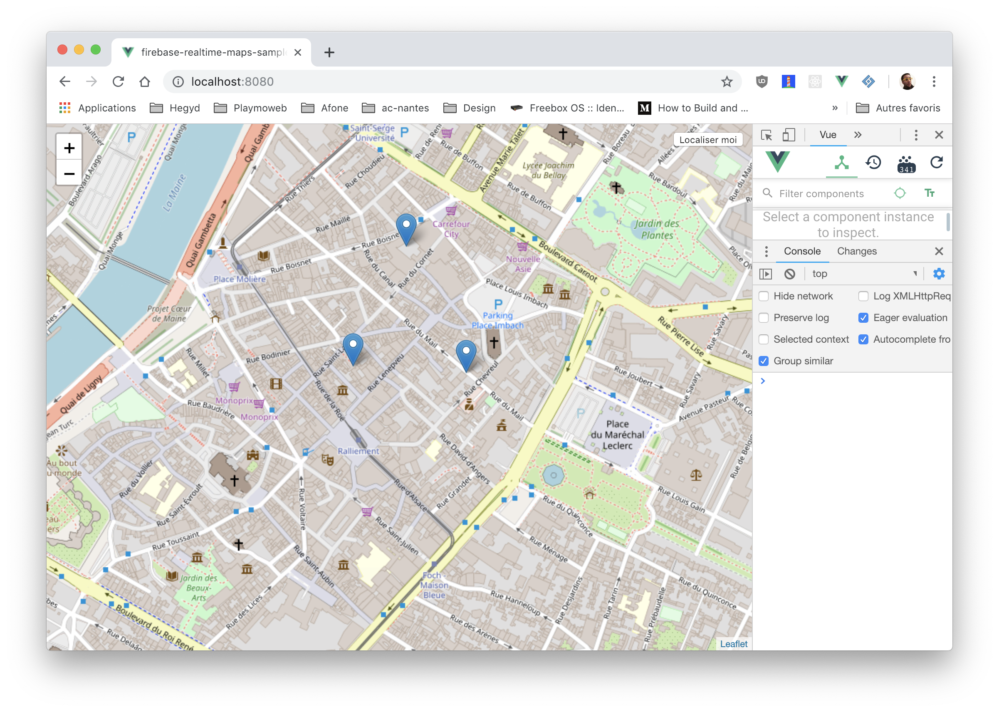

# Firebase + VueJS 3

Dans ce TP nous allons découvrir Firebase RealtimeDB (base de données temps réel). Nous allons coupler cette base de données temps réel à la puissance de VueJS pour obtenir en un rien de temps une application web surpuissante.

## Introduction

Nous allons mettre en place une carte du monde qui affiche en temps réel l'emplacement des utilisateurs qui interagissent avec la carte. Mais nous pourrions également afficher les personnes présentes sur votre site.

Firebase est une plateforme de développement d'applications web et mobiles. Elle propose des services de base de données, d'authentification, de stockage, de messagerie et de notifications. Elle est disponible gratuitement pour un usage limité. Dans ce TP nous allons utiliser la base de données temps réel et uniquement celle-ci.

::: details Sommaire
[[toc]]
:::

::: danger TP en cours de rédaction

🏗️ Ce TP est en cours de rédaction. Il est possible qu'il contienne des erreurs ou des informations incomplètes. 

En attendant, vous pouvez consulter le [TP Firebase + VueJS 2](../vuejs/firebase-vuejs.md).

:::