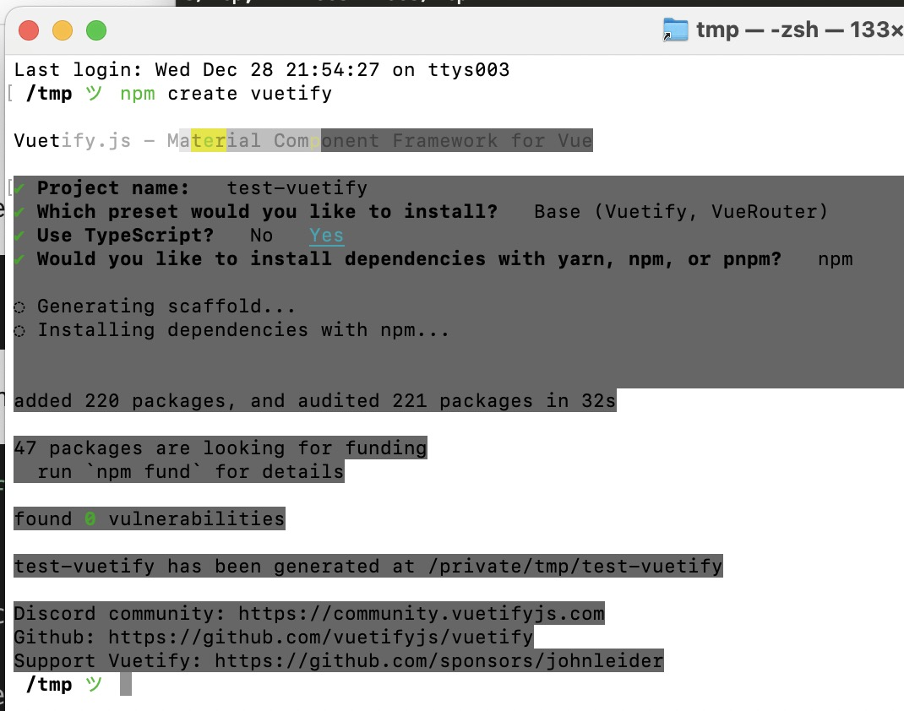
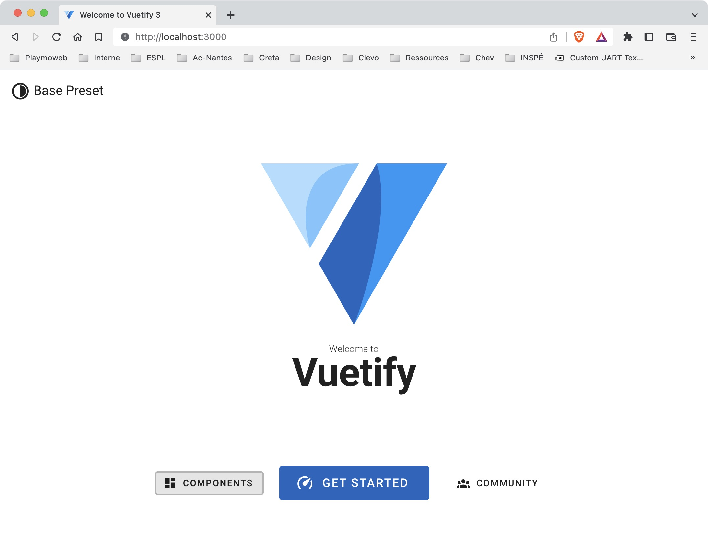
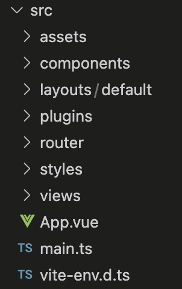

# Vuetify + VueJS 3

Dans ce TP nous allons découvrir Vuetify. Nous allons coupler cette bibliothèque de composants à la puissance de VueJS. Nous allons obtenir en un rien de temps des interfaces web.

## Introduction

Vuetify est une bibliothèque de composants graphiques pour VueJS. Elle est basée sur Material Design. Elle est disponible gratuitement et open source. Elle est très simple à utiliser et permet de créer des interfaces web très rapidement.

::: details Sommaire
[[toc]]
:::

## NodeJS

La première étape va être l’installation de NodeJS, la démarche est différente en fonction de votre environnement, mais pour résumer :

- [sous Windows c’est ici](https://nodejs.org/en/download/) prendre la version CURRENT.
- Sous OSX le plus simple c’est via [Brew](https://brew.sh) `brew install nodejs`.
- Sous Linux c’est via le gestionnaire de paquet `apt install nodejs`.

Une fois installé, vous êtes prêt !

## Vuetify

En 2022, le projet Vuetify finalise sa migration vers VueJS 3.0. Pour l'instant, il est possible d'utiliser Vuetify avec VueJS 3.

## Création du projet

Nous allons créer un nouveau projet (oui encore). Dans les projets précédents, nous avons créé le projet en utilisant la ligne de commande Vite. Ici, nous allons utiliser directement celle fournie par vuetify :

```sh
npm create vuetify
```

Vous allez avoir plusieurs choix à faire :

- `Project name` : Le nom de votre projet.
- `Preset` : Le type de base de projet (vous pouvez choisir `base`).
- `TypeScript` : Oui (nous allons utiliser TypeScript).
- `dependencies` : Nous allons choisir `npm`.



## Lancer le projet

Le projet que vous venez de créer est complètement fonctionnel. Vous pouvez le lancer avec la commande suivante :

```sh
npm run dev
```

Votre projet est accessible à l'adresse [http://127.0.0.1:3000](http://127.0.0.1:3000).



## La documentation

Avant d'aller plus loin, regardons ensemble la documentation de Vuetify. En effet, celle-ci est très complète et permet de voir l'étendue des composants que vous avez à votre disposition.

[Liste des composants](https://next.vuetifyjs.com/en/components/all/)

C'est ici que nous voyons l'importance d'utiliser une bibliothèque de composants. En effet, nous n'avons pas à nous soucier de la mise en forme des composants. Nous avons juste à les utiliser ! 

De plus les composants sont tous basés sur les règles de Material Design fourni par Google ([voir ici](https://material.io/design/introduction/)). Cela permet d'avoir une interface utilisateur cohérente et facile à utiliser sans avoir à se soucier de la mise en forme (dans une certaine mesure bien évidemment).

## Structure du projet

Le projet que nous venons de créer est très simple. Il repose sur une structure de base de projet VueJS.



L'ensemble du code qui nous intéresse réellement est dans le dossier `src` :

- Un fichier `App.vue` qui est le composant principal de notre application. Nous avons également un fichier `main.ts` qui est le point d'entrée de notre application.
- Un dossier `components` qui contient tous les composants de notre application (ici nous n'en avons qu'un seul).
- Un dossier `router` qui contient la configuration de notre routeur (la définition des routes, comment nous y accédons et quel view est utilisé).
- Un dossier `layouts` qui contient les layouts de notre application. Layout est un terme qui est utilisé dans le monde du web pour définir une page qui contient d'autres pages. Par exemple, vous pouvez avoir un layout qui contient un header, un footer et un contenu. Le contenu est la page qui est affichée. Le header et le footer sont les mêmes pour toutes les pages.
- Un dossier `plugins` qui contient les plugins de notre application. Un plugin est un module qui est chargé au démarrage de l'application. Il permet d'ajouter des fonctionnalités à notre application.
- Un dossier `views` qui contient les vues de notre application. Une vue est un composant qui est affiché dans le layout. C'est le composant qui contient le contenu de la page.

## Le routeur

Nous avons dans ce projet un routeur. Ce routeur est le même que nous avons utilisé précédemment. Cependant celui-ci est utilisé légèrement différemment, avant de continuer je vous propose de regarder le code du fichier `router/index.ts` :

```ts
const routes = [
  {
    path: '/',
    component: () => import('@/layouts/default/Default.vue'),
    children: [
      {
        path: '',
        name: 'Home',
        component: () => import(/*webpackChunkName: "home"*/ '@/views/Home.vue'),
      },
    ],
  },
]
```

👋 Quelles différences voyez-vous par rapport au routeur que nous avons utilisé précédemment ? Ne regardez pas tout de suite la réponse, essayez de trouver par vous-même (et parlons-en).

::: details Réponse

L'ensemble des routes sont des enfants (`children`) de notre route principale. Ensuite nos différentes pages sont des enfants de la route principale. Cela permet de définir un layout par défaut pour toutes les pages de notre application.

Le fameux dossier `layouts` que nous avons vu précédemment est utilisé ici. C'est une autre façon d'organiser son application. Est-ce que cela vous semble plus logique ? Est-ce que cela vous semble plus simple ?

:::

## Modifier la page d'accueil

Si vous avez regardé correctement le routeur, vous avez vu que la page d'accueil est la page `Home.vue`. C'est donc dans ce fichier que nous allons modifier le contenu de la page d'accueil.

Je vous propose de modifier le contenu de la page d'accueil pour qu'elle celle-ci contienne le nom de l'école ainsi que votre nom et prénom :

```vue
<template>
  <v-container>
    <v-row no-gutters>

      <v-col cols="4" v-for="v in data">
        <v-sheet class="text-center ma-2 pa-2">
          {{ v }}
        </v-sheet>
      </v-col>

    </v-row>

    <!-- Votre Code ICI -->

  </v-container>
</template>

<script lang="ts" setup>

const data = ["Lycée Chevrollier", "Brosseau", "Valentin"]

</script>
```

Je vous laisse tester le code ci-dessus dans votre projet.

::: tip Un instant

Qu'avons nous dans le code précédent :

- Nous avons un composant `v-container` qui permet de définir un container. C'est un composant qui permet de définir une zone de contenu.
- Nous avons un composant `v-row` qui permet de définir une ligne.
- Nous avons un composant `v-col` qui permet de définir une colonne. Cette colonne est répétée plusieurs fois grâce à la directive `v-for`.
- Nous avons un composant `v-sheet` qui permet de définir un bloc de contenu.
- Nous avons un composant `v-btn` qui permet de définir un bouton. Ce bouton permet de naviguer vers la page `/about`.


Et pour le Script ? 

- Nous avons une variable `data` qui contient un tableau de chaîne de caractères. Ce tableau est utilisé dans la directive `v-for` pour afficher les différentes valeurs.

:::

## Modifier le titre

Je ne sais pas si vous avez remarqué, mais le titre en haut à gauche de la page est « Base Preset », je vous propose de le modifier pour qu'il contienne le nom de votre application.

Si vous avez compris le découpage, je vous laisse chercher par vous-même où modifier le titre.

Je souhaite que le projet se nomme « Vuetify + VueJS ».

## Modifier l'icône à côté du titre

L'icône à côté du titre ne me va pas non plus. Je vous laisse la modifier, une icône avec vuetify est définie via le composant `v-icon`. Je vous laisse chercher par vous-même comment modifier l'icône.

Une fois l'icône trouvée, je souhaite que celle-ci soit maintenant un cœur.

Pour réaliser cette modification, vous allez avoir besoin de :

- La documentation de Vuetify : <https://next.vuetifyjs.com/en/components/icons/>
- La liste des icônes de Vuetify : <https://materialdesignicons.com/>

::: details Un bonus

Actuellement l'icône est noire, je vous propose de la rendre rouge. Pour ça rien de bien compliqué, il suffit de modifier la couleur de l'icône via une classe CSS.

```html
class="text-red"
```

:::

## Test et Évolutions

Vuetify est une librairie très puissante qui permet de gagner un temps fou. Je vous propose différentes évolutions qui vous permettront de vous familiariser avec Vuetify :

- Ajouter un bouton.
- Ajouter une card.
- Ajouter une liste.

### Le bouton

[En suivant la documentation](https://next.vuetifyjs.com/en/components/buttons/) ajouter le code *à la place du commentaire « votre code ici »* inséré :

```vue
<div class="text-center pa-10">
    <v-btn color="primary" to="/about">Page à propos</v-btn>
</div>
```

🤓 Vérifier que celui-ci s'affiche comme attendu.

À faire :

- Modifier le comportement pour que votre bouton soit un `block` (100% de la largeur).
- Ajouter une icône « flèche vers la droite » à votre bouton.

### Ajouter une card

Le composant Card est un conteneur, il va nous permettre d'ajouter d'autres éléments dedans. Il est utile pour symboliser à votre utilisateur les éléments importants.

[Toujours en utilisant la documentation,](https://next.vuetifyjs.com/en/components/cards/) ajoutez le code suivant :

```html
<v-card width="400" dark>
    <template v-slot:title>
    Ceci est un titre
    </template>

    <template v-slot:subtitle>
    Ceci est un sous-titre
    </template>

    <template v-slot:text>
    Ceci est mon contenu
    </template>
</v-card>
```

Vérifier que votre `card` s'affiche correctement.

À faire :

- Modifier la couleur de la card avec les attributs suivants `color="#385F73"`.
- Une image (https://cdn.vuetifyjs.com/images/cards/docks.jpg).

### Ajouter une liste

Le composant « Liste » va nous permettre d'afficher du contenu « sous forme de liste »… Incroyable, non ?

Comme dans les précédents exemples pour réaliser le code, *vous devez* [utiliser la documentation](https://next.vuetifyjs.com/en/components/lists/#usage).

Ajouter *dans* la balise `<template v-slot:text>` le code suivant :

```html
<v-list lines="one">
    <v-list-item v-for="item in data" :key="item" :title="item"></v-list-item>
</v-list>
```

À faire :

- Modifier la liste pour y inclure un `subtitle`.
- Modifier la liste pour y inclure un `avatar` (https://cdn.vuetifyjs.com/images/lists/1.jpg).

## Créer la page « À propos »

La page home contient un bouton qui permet de naviguer vers la page « À propos ». Il est temps de créer cette page. Comme dans le TP routeur nous allons :

- Créer un fichier `About.vue` dans le dossier `src/views`.
- Créer une nouvelle route dans le fichier `src/router/index.js`. (attention, il faut que celle-ci soit une children de la route principale).

La pr

### La page « À propos »

La page que vous allez créer va contenir :

- Un titre
- Un paragraphe
- Une timeline (<https://next.vuetifyjs.com/en/components/timelines/>) de type side.
- Un bouton qui permet de revenir sur la page d'accueil (regardez comment fonctionne le bouton sur la home).

C'est à vous je vous laisse créer la page.

### La route

Je vous laisse écrire la route. Je vous rappelle que celle-ci doit être une `children` de la route principale. Et que celle-ci doit rendre accessible le composant `About.vue` depuis le lien `/about`.

::: details Solution

```js
{
    path: '/about',
    name: 'About',
    component: () => import(/* webpackChunkName: "about" */ '@/views/About.vue'),
}
```

:::

### Aller plus loin ?

Dans le monde du mobile, les menus de navigation sont appelés des `Navigations Drawers`. Ce composant existe également chez Vuetify.

[En utilisant la documentation](https://next.vuetifyjs.com/en/components/navigation-drawers/) implémentée un `Navigation Drawer` dans votre application.

Je vous propose de l'ajouter pour que celui-ci soit disponible sur toutes les pages de votre application :

- Ajouter votre drawer dans le fichier `View.vue`.
- Ajouter un bouton qui permet d'ouvrir le `Navigation Drawer`.
- Ajouter un lien vers la page `À propos` dans le `Navigation Drawer`.
- Ajouter un lien vers la page `Home` dans le `Navigation Drawer`.

Vous pouvez utiliser un Navigation Drawer de type Rails (<https://next.vuetifyjs.com/en/components/navigation-drawers/#rail-variant>)

## Conclusion

Vous avez pu découvrir une librairie qui vous permettra de gagner un temps fou dans la réalisation de vos applications. Vous avez pu découvrir les composants de base de Vuetify et vous avez pu les utiliser dans votre application. Vous avez pu créer une page supplémentaire et l'ajouter à votre application.

Ici rien de nouveau par rapport à avant, nous avons utilisé le routeur pour naviguer entre les pages de notre application. Nous avons utilisé des composants de Vuetify pour créer notre page « À propos ».

## Pour aller plus loin

- [Documentation Vuetify](https://next.vuetifyjs.com/en/)
- [Documentation Vue Router](https://router.vuejs.org/)
- [Documentation Vue](https://vuejs.org/)